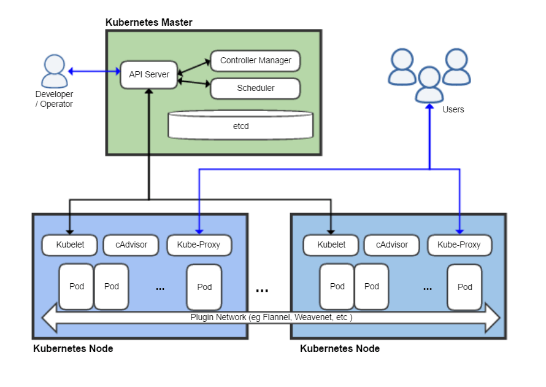

# Kubernetes là gì? Khái niệm!
- Kubernetes (còn gọi là k8s) là một hệ thống để chạy, quản lý, điều phối các ứng dụng được container hóa trên một cụm máy (1 hay nhiều) gọi là cluster. Với Kubernetes bạn có thể cấu hình để chạy các ứng dụng, dịch vụ sao cho phù hợp nhất khi chúng tương tác với nhau cũng như với bên ngoài. Bạn có thể điều chỉnh tăng giảm tài nguyên, bản chạy phục vụ cho dịch vụ (scale), bạn có thể cập nhật (update), thu hồi update khi có vấn đề ... Kubernetes là một công cụ mạnh mẽ, mềm dẻo, dễ mở rộng khi so sánh nó với công cụ tương tự là Docker Swarm!
- Kubernetes nó tương tác với các hệ thống cho phép chạy ứng dụng được container hóa và có các API phù hợp giao giao tiếp với Kubernetes (như Docker containerd cri-o rktlet ), trong phạm vi các bài viết này sẽ chọn trường hợp phổ biến là dùng Kubernetes với các máy cài đặt Docker. Bạn cần học Docker trước khi học Kubernetes 

# Sơ lược kiến trúc - các thành phần của Kubernetes

