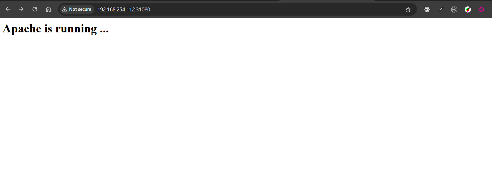

# Sử dụng PersistentVolume NFS trên Kubernetes

## Cài đặt NFS làm Server chia sẻ file (Kubernetes)

Sử dụng Volume để các POD cùng một dữ liệu, cần một loại đĩa mạng, ví dụ này sẽ thực hành dùng NFS. Ta sẽ cài đặt một Server NFS trực tiếp trên một Node của Kubernetes (độc lập, không chạy POD, nếu muốn bạn có thể cài trên một máy khác chuyên chia sẻ file).

## Cài đặt trên node master

```sh
    ssh root@192.168.254.111
    sudo apt install nfs-kernel-server


     vi /etc/exports
    /data/mydata  *(rw,sync,no_subtree_check,insecure)

    # Tạo thư mục
    mkdir -p /data/mydata
    chmod -R 777 /data/mydata

    # export và kiểm tra cấu hình chia sẻ
    exportfs -rav
    exportfs -v
    showmount -e

    # khởi động lại nfs
    systemctl restart nfs-server
    systemctl status nfs-server

    # Truy cập master 2 và thử mount thư mục xem được không
    ssh root@192.168.254.112
    sudo apt-get install nfs-common
    mkdir /home/data
    # Gắn ổ đĩa
    mount -t nfs 192.168.254.111:/data/mydata /home/data/

    # Kiểm tra xong, hủy gắn ổ đĩa
    umount /home/data

    ## Tương tự với server còn lại
```

## Tạo PersistentVolume NFS

1-pv-nfs.yaml

```yaml
apiVersion: v1
kind: PersistentVolume
metadata:
  name: pv1
spec:
  storageClassName: mystorageclass
  capacity:
    storage: 5Gi
  accessModes:
    - ReadWriteMany
  nfs:
    path: "/data/mydata/"
    server: "192.168.254.111"

#Triển khai và kiểm tra

kubectl apply -f 1-pv-nfs.yaml
kubectl get pv -o wide
kubectl describe pv/pv1
```

## Tạo PersistentVolumeClaim NFS

2-pvc-nfs.yaml

```yaml
apiVersion: v1
kind: PersistentVolumeClaim
metadata:
  name: pvc1
spec:
  storageClassName: mystorageclass
  accessModes:
    - ReadWriteMany
  resources:
    requests:
      storage: 5Gi

#Triển khai và kiểm tra

kubectl apply -f 2-pvc-nfs.yaml
kubectl get pvc,pv -o wide
```

## Mount PersistentVolumeClaim NFS vào Container

- Ta sẽ triển khai chạy máy chủ web từ image httpd.

- SSH vào máy master, vào thư mục chia sẻ /data/mydata tạo một file index.html với nội dung đơn giản, ví dụ:

<h1>Apache is running ...</h1>
Tạo file triển khai, gồm có POD chạy http và dịch vụ kiểu NodePort, ánh xạ cổng host 31080 vào cổng 80 của POD

3-httpd.yaml

```yaml
apiVersion: apps/v1
kind: Deployment
metadata:
  name: httpd
  labels:
    app: httpd
spec:
  replicas: 1
  selector:
    matchLabels:
      app: httpd
  template:
    metadata:
      labels:
        app: httpd
    spec:
      volumes:
        - name: htdocs
          persistentVolumeClaim:
            claimName: pvc1
      containers:
        - name: app
          image: httpd
          resources:
            limits:
              memory: "100M"
              cpu: "100m"
          ports:
            - containerPort: 80
          volumeMounts:
            - mountPath: /usr/local/apache2/htdocs/
              name: htdocs
---
apiVersion: v1
kind: Service
metadata:
  name: httpd
  labels:
    run: httpd
spec:
  type: NodePort
  ports:
    - port: 80
      targetPort: 80
      protocol: TCP
      name: http
      nodePort: 31080
  selector:
    app: httpd
```




##### Ổ đĩa đã hoạt động chính xác, giờ bạn có thể scale, update dù POD ở đâu thì chúng vẫn truy cập một loại ổ đĩa (đọc, ghi)

### Những Pod chạy ở Node nào thì nó đều chia sẻ cùng một thư mục dư liệu
