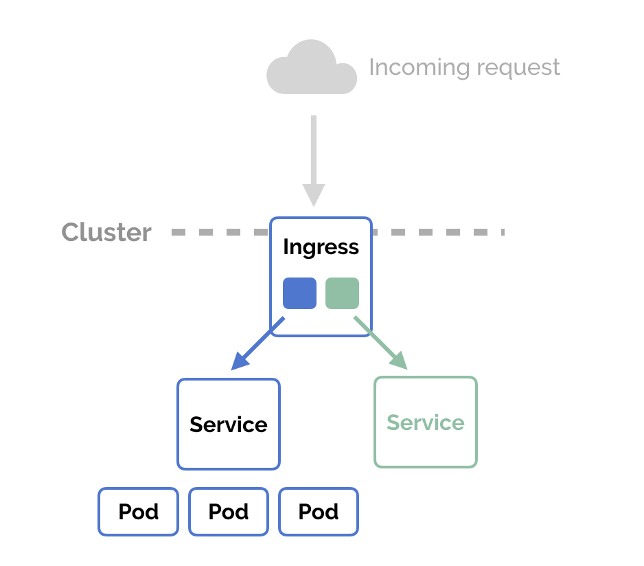
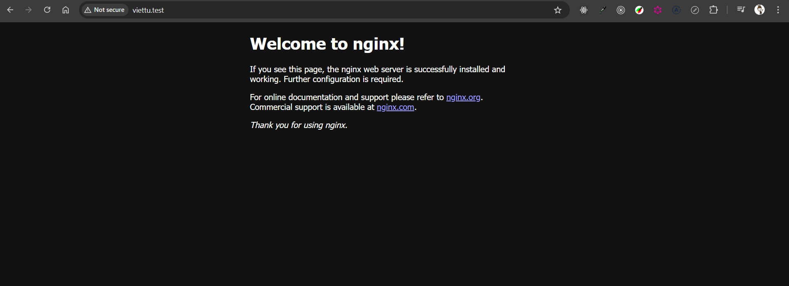
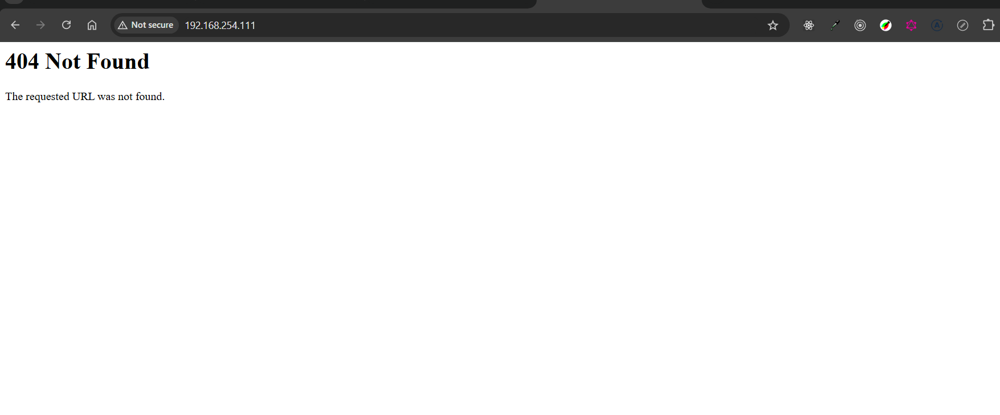
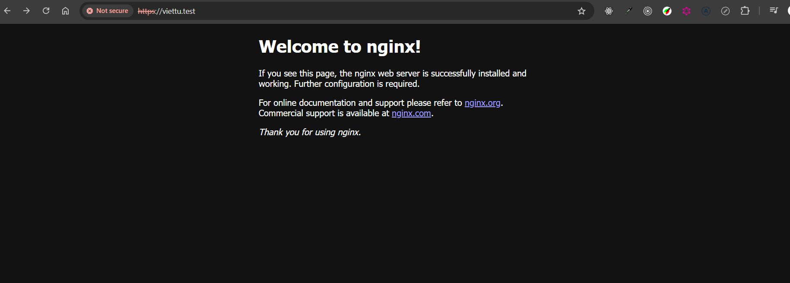

# Ingress trong Kubernetes

Ingress là thành phần được dùng để điều hướng các yêu cầu traffic giao thức HTTP và HTTPS từ bên ngoài (interneet) vào các dịch vụ bên trong Cluster.

Ingress chỉ để phục vụ các cổng, yêu cầu HTTP, HTTPS còn các loại cổng khác, giao thức khác để truy cập được từ bên ngoài thì dùng Service với kiểu NodePort và LoadBalancer

Để Ingress hoạt động, hệ thồng cần một điều khiển ingress trước (Ingress controller), có nhiều loại để chọn sử dụng (tham khảo Ingress Controller)

Nếu chọn Ngix Ingress Controller thì cài đặt theo: NGINX Ingress Controller for Kubernetes.

Phần này, chọn loại HAProxy Ingress Controller - HAProxy Ingress Controller



### Cài đặt HAProxy Ingress Controller

Để triển khai thực hiện các bước sau:

```yaml
apiVersion: rbac.authorization.k8s.io/v1
kind: ClusterRoleBinding
metadata:
  name: ingress-controller-cluster-role-binding
subjects:
- kind: ServiceAccount
  name: ingress-controller
  namespace: ingress-controller
roleRef:
  kind: ClusterRole
  name: cluster-admin
  apiGroup: rbac.authorization.k8s.io

```

```bash
#Tạo namespace có tên ingress-controller
kubectl create ns ingress-controller

# Triển khai các thành phần

kubectl apply -f https://haproxy-ingress.github.io/resources/haproxy-ingress.yaml
Thực hiện đánh nhãn các Node có thể chạy POD Ingress

# Gán thêm label cho các Node (ví dụ node worker2.xtl, worker1.xtl ...)
kubectl label node k8s-master-1 role=ingress-controller
kubectl label node k8s-master-2 role=ingress-controller
kubectl label node master-2 role=ingress-controller
kubectl label node node-1 role=ingress-controller
kubectl label node node-2 role=ingress-controller
# Kiểm tra các thành phần

kubectl get all -n ingress-controller

root@k8s-master-1:/k8s-practice/xuanthulab/pv-nfs# kubectl get all -n ingress-controller -o wide
NAME                        READY   STATUS    RESTARTS      AGE   IP                NODE           NOMINATED NODE   READINESS GATES
pod/haproxy-ingress-5bqf9   1/1     Running   2 (16s ago)   87s   192.168.254.112   k8s-master-2   <none>           <none>
pod/haproxy-ingress-6j9j9   1/1     Running   2 (26s ago)   97s   192.168.254.111   k8s-master-1   <none>           <none>

NAME                             DESIRED   CURRENT   READY   UP-TO-DATE   AVAILABLE   NODE SELECTOR             AGE     CONTAINERS        IMAGES                               SELECTOR
daemonset.apps/haproxy-ingress   2         2         2       2            2           role=ingress-controller   2m18s   haproxy-ingress   quay.io/jcmoraisjr/haproxy-ingress   run=haproxy-ingress
```

- Giờ các tên miên, trỏ tới các IP của Node trong Cluster đã được điều khiển bởi Haproxy, ví dụ cấu hình một tên miền ảo ADD host viettu.test trỏ tới IP của một NODE nào đó

- Giờ các tên miên, trỏ tới các IP của Node trong Cluster đã được điều khiển bởi Haproxy, ví dụ cấu hình một tên miền ảo chính file /etc/hosts (Linux, macoS) hoặc C:\Windows\System32\Drivers\etc\hosts (Windows), thêm vào tên miền ảo, giả sử viettu.test trỏ tới IP của một NODE nào đó

```sh
192.168.254.111 viettu.test
# or 
192.168.254.112 viettu.test
```

## Tạo một Ingress

Triển khai một ứng dụng (http) ví dụ

1.app-test.yaml

```yaml
apiVersion: v1
kind: Service
metadata:
  name: http-test-svc
  # dịch vụ này tạo tại namespace có Haproxy Ingress
  namespace: ingress-controller
spec:
  ports:
  - port: 80
    protocol: TCP
    targetPort: 80
  selector:
    run: http-test-app
  sessionAffinity: None
  type: ClusterIP
---
apiVersion: apps/v1
kind: Deployment
metadata:
  labels:
    run: http-test-svc
  name: http-test-svc
  # Deploy này tạo tại namespace có Haproxy Ingress
  namespace: ingress-controller
spec:
  replicas: 2
  selector:
    matchLabels:
      run: http-test-app
  template:
    metadata:
      labels:
        run: http-test-app
    spec:
      containers:
      - image: nginx
        imagePullPolicy: IfNotPresent
        name: http
        ports:
        - containerPort: 80
          protocol: TCP
        resources: {}

#Triển khai:
kubectl apply -f 1.app-test.yaml
```

# Tạo ingress class

```yaml
apiVersion: networking.k8s.io/v1
kind: IngressClass
metadata:
  name: haproxy
spec:
  controller: haproxy-ingress.github.io/controller
```

# Tạo Ingress

2.app-test-ingress.yaml

```yaml
apiVersion: networking.k8s.io/v1
kind: Ingress
metadata:
  name: app
  namespace: ingress-controller
spec:
  ingressClassName: haproxy  
  rules:
    - host: viettu.test
      http:
        paths:
          - path: /
            pathType: Prefix
            backend:
              service:
                name: http-test-svc
                port:
                  number: 80

```

```bash
#Triển khai:
kubectl apply -f 2.app-test-ingress.yaml
kubectl get ingress -n ingress-controller

root@k8s-master-1:/k8s-practice/xuanthulab/ingress-ha# kubectl get ingress -n ingress-controller
NAME   CLASS     HOSTS         ADDRESS   PORTS   AGE
app    haproxy   viettu.test             80      20s
```



Truy cập bằng ip thì không được


# Tạo một Ingress với cấu hình SSL

- Để cấu hình truy cập an toàn SSL, cần có các xác thực - các cert bạn mua, hoặc đăng ký miễn phí với `https://letsencrypt.org/` cho tên miền cụ thể của bạn. Tuy nhiên để thực hành, sẽ sinh cert với openssl (tự xác thực - bị cảnh báo bởi trình duyệt).

Chạy lệnh sau để sinh xác thực cho tên miền ảo viettu.test

```bash
openssl req -x509 -newkey rsa:2048 -nodes -days 365 -keyout privkey.pem -out fullchain.pem -subj '/CN=viettu.test'
```

- Sau đó tạo một Secret (thuộc namespace chạy POD), đặt tên Secret này là viettu-test

```bash
kubectl create secret tls viettu-test --cert=fullchain.pem --key=privkey.pem -n ingress-controller
```

- Xóa đi Ingress cũ

```bash
kubectl delete -f 2.app-test-ingress.yaml
```

- Tạo lại một Ingress có thiết lập xác thực SSL với cert trên

- 3.app-test-ingress-ssl.yaml

```yaml
apiVersion: networking.k8s.io/v1
kind: Ingress
metadata:
  name: app
  namespace: ingress-controller
spec:
  ingressClassName: haproxy  
  rules:
    - host: viettu.test
      http:
        paths:
          - path: /
            pathType: Prefix
            backend:
              service:
                name: http-test-svc
                port:
                  number: 80
  tls:
    - hosts:
        - viettu.test
      secretName: viettu-test 

```

- Triển khai

```bash
kubectl apply -f 3.app-test-ingress-ssl.yaml

root@k8s-master-1:/k8s-practice/xuanthulab/ingress-ha# k get ingress
NAME   CLASS     HOSTS         ADDRESS   PORTS     AGE
app    haproxy   viettu.test             80, 443   51s
```

- Truy cập: https://viettu.test



# Một số thiết lập thêm

```yaml
apiVersion: networking.k8s.io/v1
kind: Ingress
metadata:
  name: app
  namespace: ingress-controller
  annotations:
    ingress.kubernetes.io/maxconn-server: "7"
    ingress.kubernetes.io/balance-algorithm: "leastconn"  # thuật toán cân bằng tải source, leastconn, roundrobin
    ingress.kubernetes.io/timeout-queue: "2m"
    ingress.kubernetes.io/ssl-redirect: "false"

spec:
  .....
```