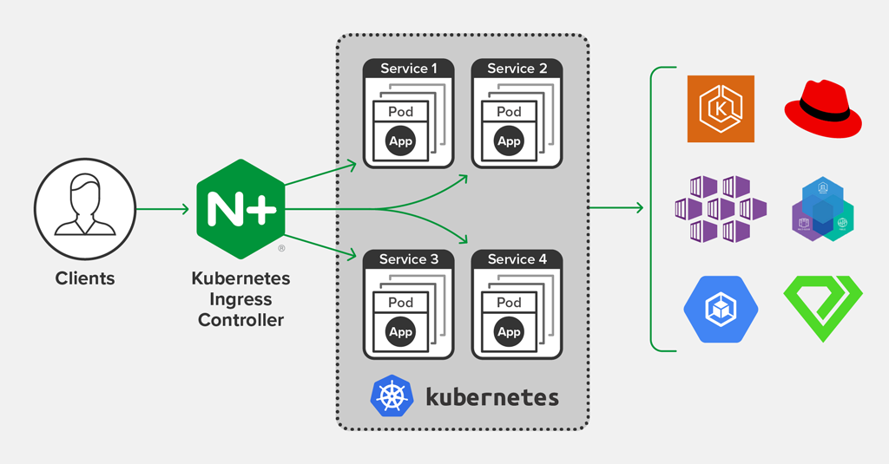

# Triển khai NGINX Ingress Controller trong Kubernetes

- Triển khai và sử dụng NGINX Ingress Controller trong Kubernetes, ví dụ tạo Ingress chuyển hướng traffic http, https vào một dịch vụ trong Kubernetes



- NGINX Kubernetes Ingress Controller là một ingress hỗ trợ khả năng căn bằng tải, SSL, URI rewrite ...

- Ingress Controller được cung cấp bởi Nginx là một proxy nổi tiếng, mã nguồn của Nginx Ingress Controller trên github tại: nginxinc/kubernetes-ingress

# Cài đặt NGINX Ingress Controller

```bash
git clone https://github.com/nginxinc/kubernetes-ingress.git
# vào thư mục tải về
cd kubernetes-ingress
```

- Các menifest (yaml) cần triển khai ở trong thư mục deployments, hãy vào thư mục này

```bash
cd deployments
```

```bash
## Xóa namesapce ingress-controller
kubectl delete ns ingress-controller

kubectl apply -f common/ns-and-sa.yaml
kubectl apply -f common/default-server-secret.yaml
kubectl apply -f common/nginx-config.yaml
kubectl apply -f rbac/rbac.yaml
kubectl apply -f daemon-set/nginx-ingress.yaml

kubectl delete -f common/ns-and-sa.yaml
kubectl delete -f common/default-server-secret.yaml
kubectl delete -f common/nginx-config.yaml
kubectl delete -f rbac/rbac.yaml
kubectl delete -f daemon-set/nginx-ingress.yaml
```

- Kiểm tra daemonset và các pod của Nginx Ingress Controller

```bash
kubectl get ds -n nginx-ingress
kubectl get po -n nginx-ingress
```

